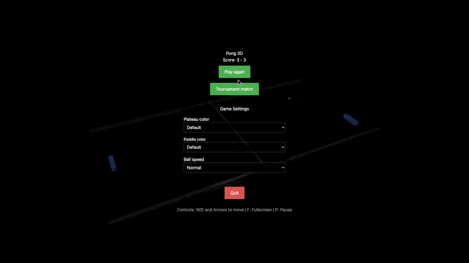

# 🎮 Ft_transcendence



> ⚠️ **Important Notice**: This repository contains only the frontend part of the project. For the complete project including backend and Docker containers, please visit the main repository at [https://github.com/EricBrvs/ft_transcendance](https://github.com/EricBrvs/ft_transcendance)

## 🚀 Description

Ft_transcendence is a modern web project that offers a real-time Pong gaming experience with an elegant user interface and social features, built as part of the 42 school curriculum.

## ✨ Features

### 🕹️ Game

- 3D Pong powered by BabylonJS
- Multiple game modes (normal, fast, turbo)
- Matchmaking system
- Customizable colors and game settings
- Fullscreen gaming experience

### 👥 Social

- Friend system
- User profiles
- Real-time chat
- Leaderboards
- Tournament system

### 🛠️ Technical

- Modern and responsive UI
- Multilingual support (en, fr, es)
- Real-time notification system
- Secure authentication
- WebSocket integration

## 🔧 Technology Stack

- **Frontend:**
  - React 19
  - TypeScript
  - BabylonJS
  - TailwindCSS
  - Vite

## 🚦 Getting Started

### Prerequisites

- Node.js (latest LTS version)
- npm or yarn

### Environment Setup

Create a `.env` file in the root directory with the following variables:

```env
VITE_BACKEND_PORT=your_backend_port
```

### Installation

1. Clone the repository

```bash
git clone https://github.com/Wormav/Ft_transcendence.git
cd ft_transcendence
```

2. Install dependencies

```bash
npm install
```

3. Start development server

```bash
npm run dev
```

4. For network access (development)

```bash
npm run host
```

### Available Scripts

- `npm run dev` - Start development server
- `npm run host` - Start server with network access
- `npm run build` - Build project
- `npm run lint` - Run linter
- `npm run preview` - Preview production build
- `npm run format` - Format code using Prettier

## 🎯 Project Structure

```
src/
├── components/     # Reusable components
├── context/       # React contexts
├── hooks/         # Custom hooks
├── locales/       # Translation files
├── pages/         # Application pages
├── styles/        # Global styles
├── types/         # TypeScript types
└── utils/         # Utilities
```

## 🎨 Customization

The game offers various customization options:

- Paddle colors
- Board color
- Ball speed settings
- Multiple camera views
- Game difficulty levels

## 📝 License

This project is part of the 42 school curriculum.

---

## 👥 Team

Made with ❤️ by the Ft_transcendence team

- [Mastau](https://github.com/Mastau/cub3d)
- [Wormav](https://github.com/Wormav)
- [aauberti](https://github.com/aauberti)
- [EricBrvs](https://github.com/EricBrvs)
